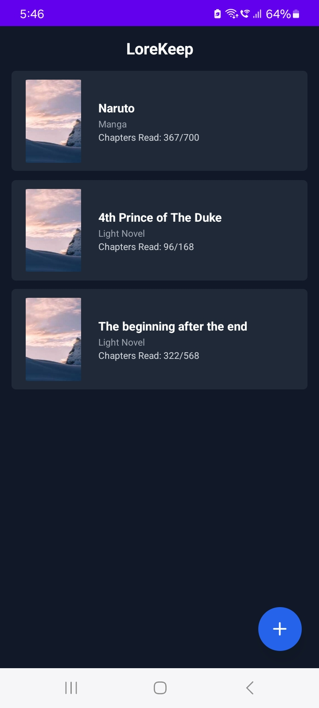
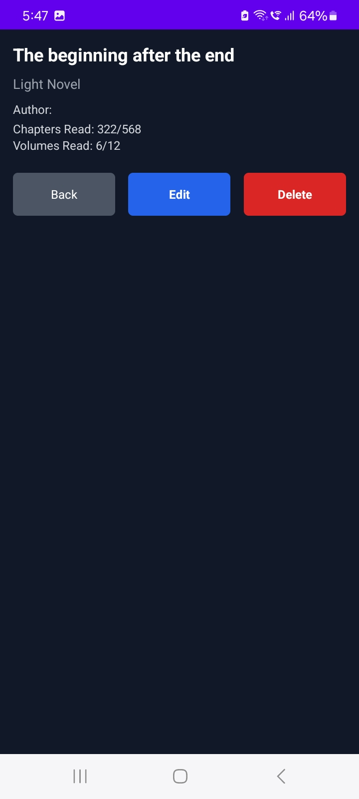

# LoreKeep - Version 1.0.0

**LoreKeep** is an app designed to help you track books, web novels, light novels, and comics. With **LoreKeep**, you can add, view, edit, and remove your entries, track reading progress, and keep track of your reading journey. This is the **Basic CRUD Version 1.0.0** release.

---

## Features

### CRUD Operations:
- **Create**: Add new books, light novels, web novels, or comics by entering details such as title, author, chapters, and more.
- **Read**: View a list of all books/novels/comics with a detailed view showing all relevant information.
- **Update**: Edit existing entries, including updating chapter progress and other details like title, author, and cover image.
- **Delete**: Remove books/novels/comics from your list when you're done with them or no longer wish to track them.

### Data Persistence:
- Store your entries and progress locally using **AsyncStorage** or **SQLite**.

---

## Screenshots


*Home screen displaying the list of entries.*


*Detailed view showing book/novel/comic information.*

---

## Installation

To run **LoreKeep** locally, follow these steps:

1. Clone the repository:
   ```bash
   git clone https://github.com/yourusername/LoreKeep.git
   ```

2. Navigate to the project directory:
   ```bash
   cd LoreKeep
   ```

3. Install dependencies:
   ```bash
   npm install
   ```

4. Run the app on your device or emulator:
   ```bash
   npm start
   ```

5. Follow the on-screen instructions to open the app in your preferred simulator or connected device.

---

## Folder Structure

```plaintext
LoreKeep/
├── assets/            # Images and static assets (cover images, etc.)
├── src/               # Source code for the app
│   ├── screens/       # Screens for the app (HomeScreen, AddEditScreen, etc.)
│   ├── utils/         # Utility functions for data management
│   └── App.js         # Main entry point for the app
├── App.js             # Entry point for the app
├── package.json       # Project configuration and dependencies
└── README.md          # This file
```

---

## Tech Stack

- **React Native**: For building cross-platform mobile apps.
- **AsyncStorage / SQLite**: For local data storage.
- **React Navigation**: For navigation between app screens.
- **State Management**: React's `useState` and `useContext` (consider Redux for future releases).

---

## Contributing

Feel free to fork this project, create branches, and submit pull requests. If you find any issues or bugs, please create an issue on GitHub.

To contribute:
1. Fork the repo.
2. Create a new branch.
3. Make your changes and test them.
4. Commit and push your changes.
5. Create a pull request.

---

## License

This project is licensed under the MIT License - see the [LICENSE](LICENSE) file for details.

---

## Future Features

- Fetch real-time updates for chapters/volumes from sites like NovelBin.
- Search functionality for easier navigation.
- Integration with APIs to get book/novel details automatically.

---

## Acknowledgements

- **React Native** for mobile development.
- **AsyncStorage** for local data persistence.
- **React Navigation** for navigation handling.


### Key Sections to Note:
- **Installation**: Step-by-step guide to set up and run the project locally.
- **Folder Structure**: Outlines the organization of the project files for clarity.
- **Tech Stack**: Describes the technologies used to build the app.
- **Contributing**: Explains how others can contribute to the project.
- **License**: Mention that the project is under the MIT License 
